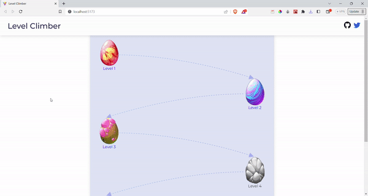

# Level Climber

## Introduction

**Level Climber** is a simple slider navigator which uses **ContextApi** for statemanagement. Upon completion of set Slides next level is opened.

## Features

- **ContextApi** for statemanagement.
- Slides were created using **Canvas**..
- SVG is generated between levels based on the div's positions, so responsive design.
- when users leaves at certail level's slideindex, upon revisiting the website last visitied slide is shown. 
- **Local storage** is used to store completed levels, slide index and current level.

## Technologies Used

- React.js: JavaScript library for building user interfaces
- React Router: Routing library for handling navigation in React apps
- SVG generator for the curve path.

## Screenshot

### Responsive Design Version


### working of game



### url check


## Getting Started

To get started with the Level climber, follow these steps:

1. Clone the repository:

   ```bash
   git clone <repository-url>
   ```

2. Install the dependencies:

   ```bash
   npm install

   ```

3. Start the development server:

   ```bash
   npm start
   ```

4. Open your web browser and visit http://localhost:3000 to access the Level Climber.

# Folder Structure

The project structure is organized as follows:

- src: Contains the source code of the Level Climber.
- components: Contains reusable components used throughout the app.
- pages: Contains the main pages of the app.
- App.jsx: The main component that renders the app.
- main.jsx: The entry point of the app.
- data: Contains slides details.
- Context: Contains file using Context API

# Contributing

Contributions to the Level Climber are welcome! If you find any bugs or have suggestions for improvements, please create an issue or submit a pull request.

## Author

My name is Avinash Tallapaneni, and I am a front-end web developer passionate about creating immersive and engaging user experiences. CineSpectrum is a project that showcases my skills and dedication to building high-quality web applications.

- Website - [Preview site on Netlify](https://levelclimber.netlify.app/)
- GitHub - [GitHub Profile](https://github.com/avinash-tallapaneni)
- Twitter - [Twitter Profile](https://twitter.com/TallapaneniAvi)

## Feedback

I appreciate any feedback you have on CineSpectrum. If you have any suggestions, bug reports, or general feedback, please feel free to

# License

This project is licensed under the MIT License.
Feel free to modify the content to match your project and provide additional information as needed.
